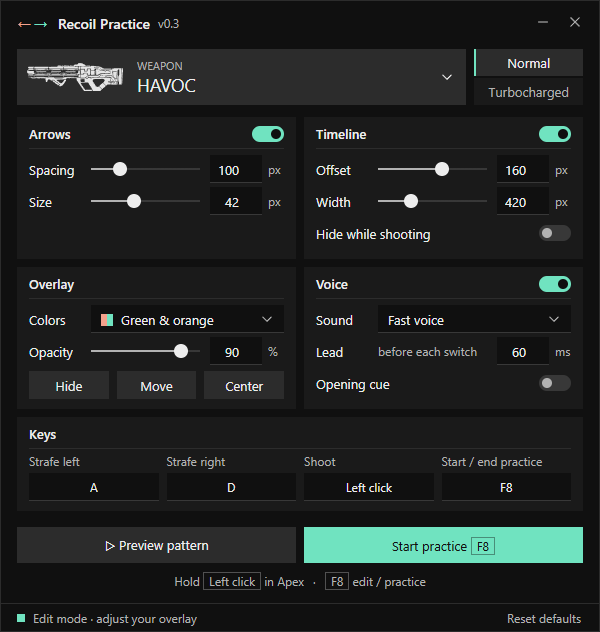

# Recoil Practice

Recoil Practice is a Windows overlay for Apex Legends. It shows the strafe pattern of a weapon while you shoot. Then it compares your strafes with the pattern and gives a score. 

The program only reads the mouse and the keyboard. It does not send input to the game. 

## Credits

- This project is a fork of [superglide-overlay](https://github.com/AlexKimmel/superglide-overlay) by AlexKimmel (MIT License).
- The weapon patterns and the weapon icons come from the [Apex recoil strafe trainer](https://www.apexrecoilstrafing.com/).
- [Wails](https://wails.io/) supplies the window and the build tools.

## Use

There's no countdown, the practice starts once you start shooting (holding leftclick).


https://github.com/user-attachments/assets/5512f863-05c0-4c45-9105-68176445ffe5



## Download

1. Download `recoil-overlay.exe` from the [latest release](../../releases/latest).
2. Start the program. No installation is necessary.

The program operates on Windows 10 and Windows 11 (64-bit). The Microsoft Edge WebView2 Runtime is necessary.

**Note:** The file has no code signature. Windows SmartScreen can show a warning when you start the program.

## Build

These items are necessary:

- Windows (amd64)
- Go 1.23
- Node.js 20 or later
- Wails CLI 2.10.1

Install the Wails CLI:

```powershell
go install github.com/wailsapp/wails/v2/cmd/wails@v2.10.1
```

Build the program:

```powershell
.\scripts\build.ps1
```

The script installs the frontend packages, does the Go tests and builds `build\bin\recoil-overlay.exe`. Add `-Dev` to start the program in the Wails development mode.

## Credits

- This project is a fork of [superglide-overlay](https://github.com/AlexKimmel/superglide-overlay) by AlexKimmel (MIT License).
- The weapon patterns and the weapon icons come from the [Apex recoil strafe trainer](https://www.apexrecoilstrafing.com/).
- [Wails](https://wails.io/) supplies the window and the build tools.

Apex Legends is a trademark of Electronic Arts Inc. This project has no relation to Electronic Arts or Respawn Entertainment. The weapon icons in `frontend/src/assets/weapons` are their property, and the MIT License does not apply to them.

## Maintenance

The tests, the release procedure and the design are in the [maintainer notes](docs/maintaining.md).

## License

[MIT](LICENSE)
